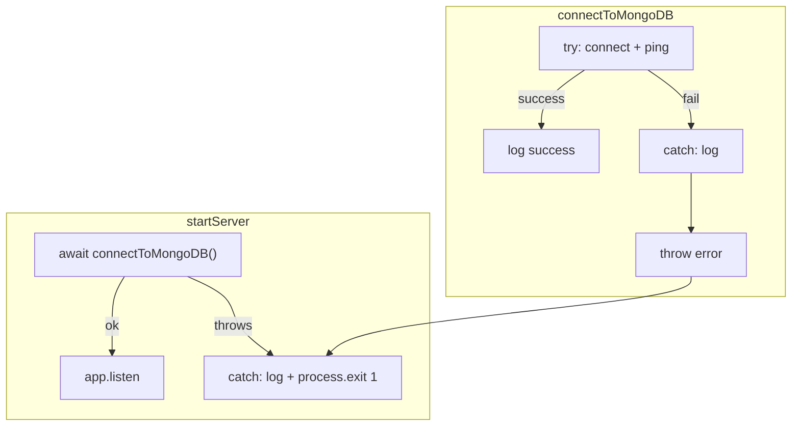
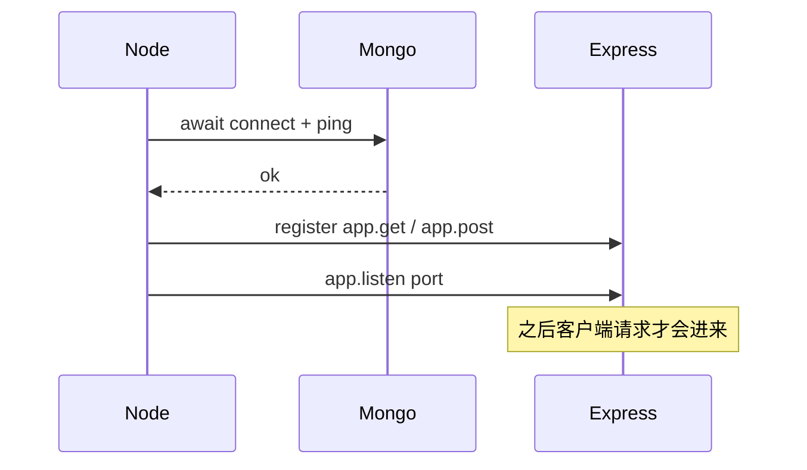
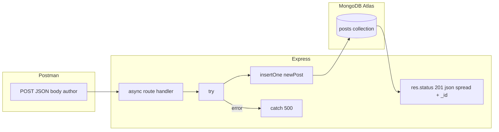

# Megaphone Server — 今日学习笔记 / Study Notes (2026-04-29)

中英文对照整理自 megaphone-server 学习与调试过程。This document summarizes what we covered while building the MongoDB + Express + Node (MEN) microblog backend.

---

## 1. 技术栈与作业目标 / Stack and assignment goals

**中文：** 项目使用 **MongoDB**（数据）、**Express**（HTTP 服务）、**Node**（运行环境）。前端可用纯 HTML/CSS/JS，通过 `fetch` 调后端；先用 **Postman** 验证 API 即可。

**English:** The stack is **MongoDB** (persistence), **Express** (HTTP API), **Node** (runtime). The frontend can stay plain HTML/CSS/JS using `fetch`; **Postman** is enough to verify the backend first.

**作业四条（注释里）：** (1) 新增 post：`body`、`author`、创建时间；(2) 读取全部；(3) 删除；(4) 可选编辑。

**Assignment (from comments):** (1) Create a post with body, author, and creation time; (2) read all; (3) delete; (4) optional edit.

---

## 2. SQL 与 MongoDB 的对应 / SQL vs MongoDB mental model

| SQL | MongoDB |
|-----|---------|
| database | database（库名） |
| table | **collection**（集合） |
| row | **document**（文档，常为 JSON 对象） |

**中文：** 不必像 SQL 那样先跑 DDL 建表。第一次对某个 `db.collection(...)` 执行 **`insertOne`** 时，**database 与 collection 会按需出现**；Atlas **Data Explorer** 里就能看到。

**English:** You usually **do not** need a `CREATE TABLE` equivalent first. The **first write** (`insertOne`) to a named database and collection **creates** them; you will see them in Atlas **Data Explorer**.

---

## 3. 连接 Mongo：长期运行不要立刻 close / Connection: keep the client open

**中文：** 官方「connect → ping → `finally` 里 `client.close()`」适合**一次性脚本**。Express **长时间运行**时应在进程存活期间**保持连接**，在路由里复用同一个 `client`（或 `db` / `collection` 引用）。

**English:** A sample that **closes the client in `finally` after ping** is for **short scripts**. A long-running Express app should **keep** the `MongoClient` **open** and reuse it for routes.

---

## 4. try / catch / throw：错误要传到外层 / Error propagation
### 启动服务器时的best practice是用try catch throw

**中文：** 若在 `connectToMongoDB` 的 `catch` 里**只 `console.error` 而不 `throw`**，外层 `await connectToMongoDB()` 仍会当作成功，**`app.listen` 仍会执行**，终端显示 “Server is running” 但库可能未连上。在 `catch` 末尾 **`throw error`** 可把失败传给 `startServer`；启动失败时 **`process.exit(1)`** 可避免进程空挂、误以为服务就绪。

**English:** If an inner `catch` **only logs** and does **not** `throw`, the outer `await` still **resolves**, so **`listen` may run** even though the DB connection failed. **`throw error`** rethrows to the caller; **`process.exit(1)`** on fatal startup failure avoids a misleading “running” process.

---

## 5. Express：先写路由，再 listen / Routes before `listen`

**中文：** **`app.listen`** 表示开始监听端口、接受请求。若在它之后才注册 **`app.post` / `app.get`**，请求可能找不到对应处理。**习惯顺序：** 先登记路径处理逻辑，**最后** `listen`。另一种作业常见写法：在 **`startServer`** 里 **`await connectToMongoDB()`** 之后、**`listen` 之前**写路由；两种都能工作，关键是 **listen 在最后**。

**English:** **`app.listen`** starts accepting HTTP traffic. Register **`app.post` / `app.get`** **before** `listen` (or ensure those lines run before listen in your startup flow). Common pattern: **routes first, `listen` last**. Some courses put routes **inside `startServer`** between **`await connect`** and **`listen`**; both styles work if ordering is clear.

---

## 6. 代码顺序：先有 client，再有 db / Declaration order

**中文：** **`const client = new MongoClient(...)`** 必须写在 **`client.db(...)`** 之前，否则会出现 “Cannot access client before initialization”。

**English:** Declare **`MongoClient`** **before** using **`client.db(...)`** / **`client.collection(...)`**.

---

## 7. POST：插入文档 / POST: insert a document

**中文：** 使用 **`await postsCollection.insertOne(doc)`**。`doc` 含 `body`、`author`；**创建时间**建议用服务端 **`createdAt: new Date()`**，避免客户端伪造。`insertOne` 返回 **`result.insertedId`**（即新文档的 **`_id`**）。响应可用 **`{ ...newPost, _id: result.insertedId }`**：展开运算符 **`...`** 把 `newPost` 的字段抄进新对象，再补上 **`_id`**。 要加上id是因为post document到database时，database会自动添加id，这里我们希望看到和database一样的结果，所以加上

**English:** Use **`await collection.insertOne(document)`**. Prefer server-side **`createdAt: new Date()`** for “time created”. The result includes **`insertedId`**, same value as the stored **`_id`**. **`{ ...newPost, _id: result.insertedId }`** spreads fields from `newPost` and adds **`_id`** for the JSON response.

**行业习惯 / Common style:** 简单路由里 **内联 `async (req, res) => { try { ... await ... } catch ... }`** 最常见；复杂逻辑再抽到 service/controller。

**Common style:** For simple routes, an **inline `async` handler with `try/catch` and `await`** is most common; extract helpers when logic grows.

---

## 8. GET：从 Mongo 读列表，没有内存里的 `posts` 数组 / GET: read from Mongo, not a fake array

**中文：** 不像电影片单示例里的内存 **`movies`** 数组。应 **`await postsCollection.find().toArray()`**（`find()` 无筛选即全部）。结果变量只在本次请求里使用即可。

**English:** Unlike an in-memory **`movies`** array, load posts with **`await collection.find().toArray()`** (no filter means all documents).

---

## 9. 内层 async 函数：外层要记得 await / Nested async: outer must await
### javascript不像其他语言是严格line by line运作的，它可能一行code没有完全跑完就跳到下一行，尤其是有一些code return的是一个promise的时候， Promise 是什么（尽量不装术语）
很多「要等一下才有结果」的操作（比如问数据库插一条、查列表），在 JavaScript 里会给你一个东西，大意是：「我已经去办了，办完后要么给你结果，要么告诉你办砸了」。
大家把这个东西叫 Promise，你可以先把它想成：「一张还没兑现的回执」。
await：意思是 「我站在这里，等这张回执兑现完，再继续往下写」（在同一个小函数里）。

**中文：** 若定义 **`async function createPost() { await insertOne(...) }`** 却只写 **`createPost()`** 而没有 **`await createPost()`**，外层 **`async (req, res) => { ... }`** 可能很快结束，Express 与错误处理容易错位；**内层**的 `await insertOne` **只保证内层内部**顺序。修复：**`await createPost()`**，或去掉内层、逻辑全写在外层。

**English:** If you call an **`async` inner function** without **`await`**, the **outer** handler may **finish before** the inner work completes. Fix with **`await inner()`** or **flatten** the code into one `async` route handler.

**Promise（人话）：** 可理解为「**稍后才出结果的单子**」。**`await`** = 在**当前这个 async 函数里**等这张单子兑现后再往下写。不是每一行都要 `await`，只对 **返回 Promise / async 调用**、且**下一逻辑依赖其结果**时使用。

**Promise (plain words):** Think “**work that finishes later**”. **`await`** means “**in this `async` function**, wait here until that work finishes”. You do **not** `await` every line—only **async** operations you need to **serialize** or whose **errors** you want in the same `try/catch`.

---

## 10. 作用域：内层声明的 `const` 外层拿不到 / Scope: `newPost` inside inner function

**中文：** **`const newPost = { ... }`** 若在 **`createPost` 内部**，外层 **`res.json(newPost)`** 中的 **`newPost` 未定义**（`ReferenceError`）。应 **`return newPost`** 再 **`const saved = await createPost()`**，或把 `newPost` 写在与 `res.json` 同一层。

**English:** A **`const`** inside a nested function is **not visible** outside. **`return`** the value and **`await`** it, or keep **`newPost`** in the **same scope** as **`res.json`**.

---

## 11. Postman 自测清单 / Postman checklist

1. 终端在项目目录运行：`node SERVER.JS`（或你的入口文件名）。  
   Run from project dir: `node SERVER.JS` (or your entry file).
2. **POST** `http://localhost:3000/posts`，Body → raw → **JSON**，例如 `{"body":"...","author":"..."}`。  
   **POST** same URL with **JSON** body `body` + `author`.
3. 期望 **201**，响应含 **`createdAt`**、**`_id`**。  
   Expect **201** with **`createdAt`** and **`_id`**.
4. **GET** `http://localhost:3000/posts` 应返回数组。  
   **GET** same base path should return an **array**.

---

## 12. 一张总览：POST 请求在服务器里怎么走 / End-to-end POST flow

---

## 相关文件 / Related files

- 入口与路由：[`../SERVER.JS`](../SERVER.JS)（若本地使用小写 `server.js`，在大小写不敏感的文件系统上可能是同一文件）。  
- 环境变量：`.env` 中的 **`MONGODB_URI`**（与代码里 `process.env` 名称一致即可）。

---

*笔记为学习整理，非课程官方文档。Notes for personal study; not an official course handout.*
