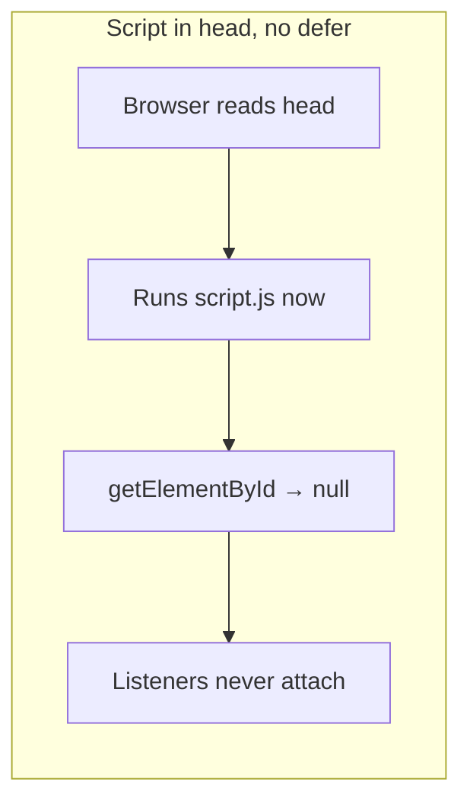
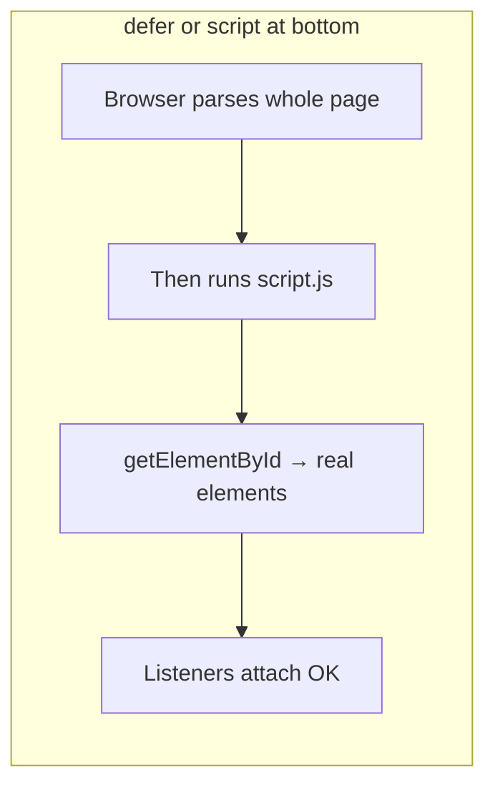
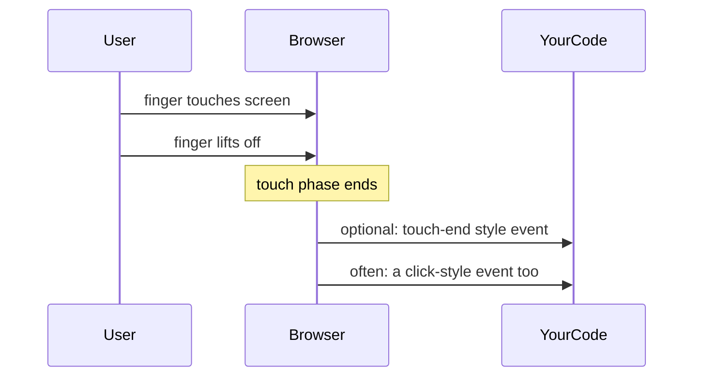
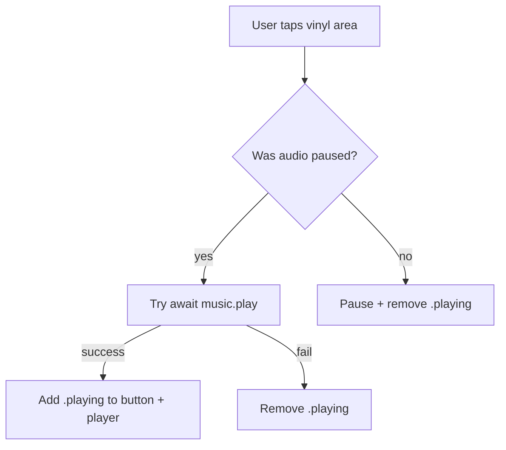
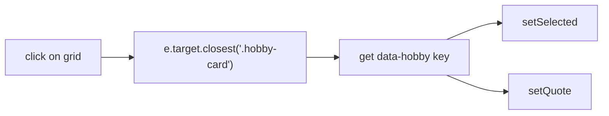

# Phoenix Li — personal site notes (vinyl, skills, Life section, and JavaScript)

This file saves what we learned while moving the music player script out of the HTML file, fixing touch behavior, and adding interactive **Life** hobby cards. The language is plain on purpose.

---

## 1. What this folder is

- **`PhoenixLi.html`** — the page.
- **`phoenixli.css`** — styles (including the vinyl look and the `.playing` state for the tonearm).
- **`script.js`** — behavior: play/pause audio and toggle the “playing” look; **Skills** chips are built from the `SKILLS` array (name + category). Edit that array to add or re-label skills; filter buttons in the HTML use `data-category` values `all`, `build`, `data`, `cloud`, and `people`. The **Life** section hobby buttons swap quote text from a `LIFE_BLURBS` map (see §9).

---

## 2. Why the player broke when JavaScript moved to `script.js`

The browser reads the page **from top to bottom**.

### Script in `<head>` with no `defer`

If you load `script.js` in the `<head>` **without** `defer`, the browser runs your file **immediately** — **before** it has created the elements in `<body>`.

So this line runs too early:

```js
document.getElementById('vinylPlayer')  // → null (not created yet)
```

Then adding a listener fails, and nothing works.



### Fix: wait until the HTML exists

Either:

- Put `<script src="script.js" defer></script>` in the head — **`defer` means “run after the document is parsed”**, or  
- Put `<script src="script.js"></script>` **just before** `</body>`.

Then `#vinylPlayer`, `#vinylBtn`, and `#bgMusic` exist when your code runs.



**Takeaway:** moving code to a separate file did not break logic by itself. **Running the script before the DOM existed** broke it. `defer` (or a bottom-of-body script) fixes the timing.

---

## 3. Phones: one tap can look like “two events”

On a **phone**, one light tap is still **one user action**. But the browser may send **more than one kind of signal** so old mouse-only sites keep working.

Rough picture:



If **two different signals** each call “toggle play/pause,” you toggle **twice** — play then pause — so the UI snaps back (e.g. tonearm does not stay).

**Takeaway:** one finger tap should trigger **one** toggle in your code.

---

## 4. What `click` is (simple)

- **Mouse:** press button, release — the browser usually turns that into **one `click`**.
- **Phone:** finger down, finger up — the browser usually still ends with **one `click`** for a simple tap on something clickable.

So **listening only to `click`** is normal for “tap this button” and works for **both** desktop and phone for this player.

---

## 5. Old pattern: `touchend` + `click` + `preventDefault`

Some code listens to:

- **`touchend`** — finger left the screen; and  
- **`click`** — the familiar “click.”

On touch devices, **both** might fire for **one** tap. To avoid double work, people sometimes call **`preventDefault()`** on the touch event so the browser **skips** the extra `click`.

That can work — but on some browsers, touch listeners are **passive** by default, which means **`preventDefault()` may be ignored**. Then the extra `click` still happens → **double toggle** again.

**Takeaway:** `touchend` + `click` is not “wrong,” but you must be careful, or you get two toggles. A simpler approach for this site: **one listener on `click` only.**

### Archived reference — full inline `<script>` (old pattern)

This lived **at the bottom of `<body>`** (after the vinyl HTML existed). It is kept here so nothing is lost after you merge the external `script.js` version.

```html
<script>
    var player = document.getElementById('vinylPlayer');
    var btn = document.getElementById('vinylBtn');
    var music = document.getElementById('bgMusic');

    function toggleMusic() {
        if (music.paused) {
            music.play();
            btn.classList.add('playing');
            player.classList.add('playing');
        } else {
            music.pause();
            btn.classList.remove('playing');
            player.classList.remove('playing');
        }
    }

    player.addEventListener('click', toggleMusic);
    player.addEventListener('touchend', function (e) {
        e.preventDefault();
        toggleMusic();
    });
</script>
```

**Notes on this snapshot**

- **`touchend` + `preventDefault()`** was meant to stop the browser from also sending a synthetic `click` after the same tap (so `toggleMusic` would not run twice).
- **`music.play()`** was not awaited; classes were added right away even if the browser later blocked autoplay.
- Same logic in an external file must still run **after** the DOM exists (`defer` or script before `</body>`).

---

## 6. How `script.js` fixes things today

1. **Runs after DOM is ready** — use `defer` on the tag in HTML (or put the script at the end of `<body>`).
2. **One door in** — only `player.addEventListener('click', …)` calls `toggleMusic()`. One tap → one toggle.
3. **`await music.play()`** — `play()` can fail (browser autoplay rules). We only add the `.playing` class **after** play succeeds; on failure we clear the playing look.



---

## 7. Quick checklist for future you

| Symptom | Likely cause |
|--------|----------------|
| Nothing happens on click | Script ran too early, or wrong path to `script.js` (404). |
| Tonearm flashes then returns on phone | Two handlers fired for one tap (e.g. touch-end + click). |
| No sound but UI “plays” | `play()` failed; using `await` + `try/catch` keeps UI honest. |

---

## 8. HTML reminder

Keep something like this (either is fine):

```html
<!-- In <head> -->
<script src="script.js" defer></script>
```

or

```html
<!-- Just before </body> -->
<script src="script.js"></script>
```

---

## 9. Life section: interactive hobby cards

In **`#life`**, each hobby is a **`<button class="hobby-card">`** with a **`data-hobby`** key. Clicking one updates the paragraph **`#lifeQuoteText`** and the line **`#lifeQuoteAttr`** below the grid. One card stays visually “selected.” To change the copy, edit the **`LIFE_BLURBS`** object in **`script.js`** (no need to duplicate it here).

### Why an IIFE wraps this block

The Life logic lives inside **`(function () { … })();`** — an **immediately invoked function expression**. It runs **once** when **`script.js`** loads (with **`defer`**, after the DOM exists). Variables such as **`grid`**, **`LIFE_BLURBS`**, and the helper functions stay **inside** that function, so they do not become globals. **`script.js`** already uses separate IIFEs for the vinyl player and the skills filter; this third block is the same idea: one **sealed scope** per feature in a single file.

### Guard clause

If **`.hobby-grid`**, **`#lifeQuoteText`**, or **`#lifeQuoteAttr`** is missing, the code **`return`s** immediately. That avoids errors (for example calling **`addEventListener`** on **`null`**) if the HTML changes or the script is reused elsewhere.

### `LIFE_BLURBS` and `setQuote`

**`LIFE_BLURBS`** is a plain object: keys match **`data-hobby`** on each button (**`reading`**, **`muay-thai`**, etc.). Each entry has **`text`** and optional **`attr`**. **`setQuote(key)`** looks up the entry, sets **`quoteEl.textContent`**, and either shows **`— attribution`** or clears the attr node and sets the HTML **`hidden`** attribute when there is nothing to show. Using **`textContent`** keeps the update as plain text (safe and simple).

### Click handler, **`e`**, and event delegation

The listener is attached to **`grid`**, not to each button. That pattern is **event delegation**: one listener handles every card.

When the user clicks, the browser calls your function with an **event object** — often named **`e`** or **`event`**. **`e.target`** is the **exact** node that received the click (sometimes a **child** inside the button, like the label). **`e.target.closest('.hobby-card')`** walks **up** the DOM until it finds the hobby **button**, so you always get the right element. **`grid.contains(btn)`** is a sanity check that the hit target really belongs to this grid. Then **`getAttribute('data-hobby')`** gives the key for **`LIFE_BLURBS`**.



### `setSelected` vs `setQuote`

- **`setQuote(key)`** only changes the **text** under the buttons.
- **`setSelected(activeBtn)`** loops all **`.hobby-card`** nodes and sets **`aria-pressed`** to **`"true"`** on the clicked button and **`"false"`** on the others.

So **`setQuote`** is enough if you only care about the sentence. **`setSelected`** exists so **one** control is clearly the **active choice**: for **CSS** (selected border/background) and for **accessibility** (**`aria-pressed`** tells assistive tech which option is pressed).

### CSS: default look vs selected

The **normal** card is styled by **`.hobby-card`** (border, transparent background, padding, button reset). **`.hobby-card:hover`** and **`.hobby-card:focus-visible`** add interaction feedback.

The **selected** state is **`.hobby-card[aria-pressed="true"]`** — stronger border and a light pink background. There is **no** separate rule for **`aria-pressed="false"`**: those buttons simply **do not** match the **`true`** selector, so they keep the **base** **`.hobby-card`** styles.

### `:focus-visible` and keyboard focus

When you move through the page with **Tab**, the focused hobby button should be **visible**. **`:focus-visible`** applies a **focus ring** (outline) in that situation so keyboard users can see where they are. It is not the same as **`:hover`** (mouse only). Try **Tab** on the live page to see the pink outline on the focused card.

### `aria-live="polite"` on the quote block

The quote container uses **`aria-live="polite"`** so that when the paragraph text **changes**, screen readers can **announce** the update without interrupting the user mid-sentence.

---

*Written as study notes — not a formal spec. If behavior changes in a future browser, re-test on real phones.*
